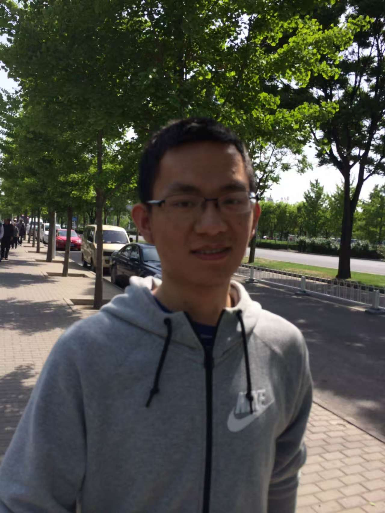
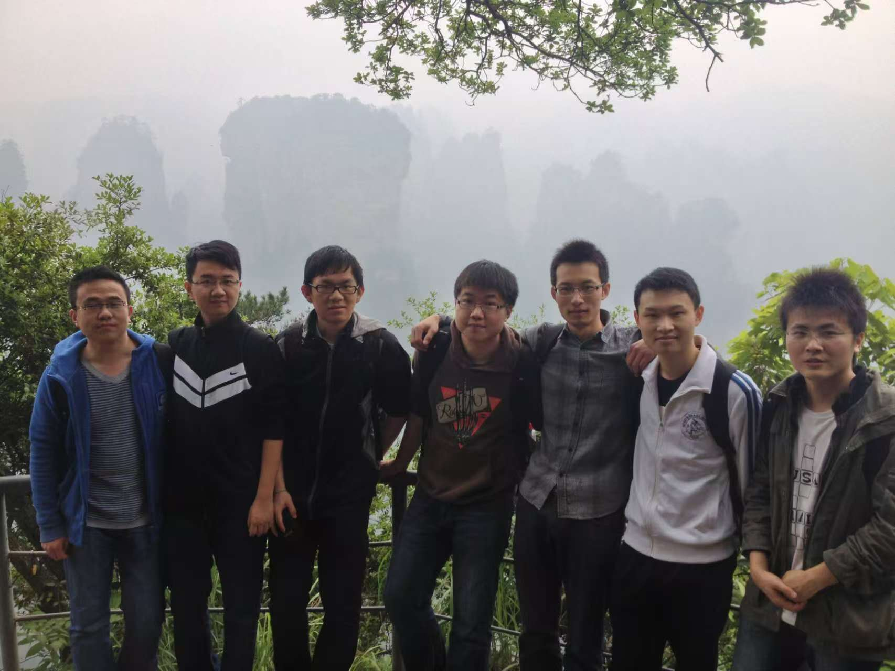
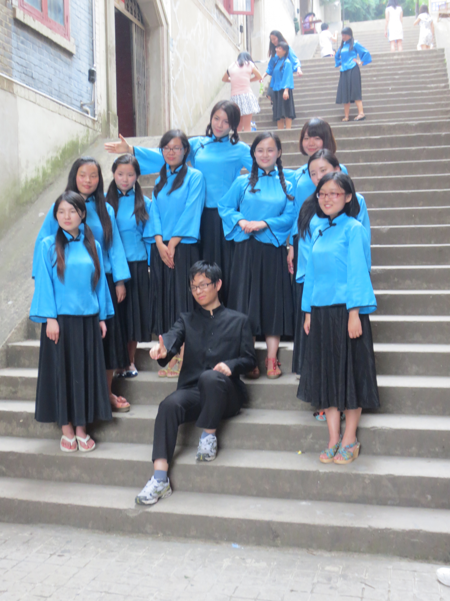
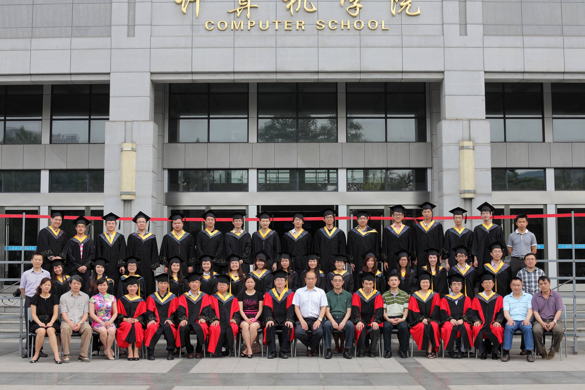
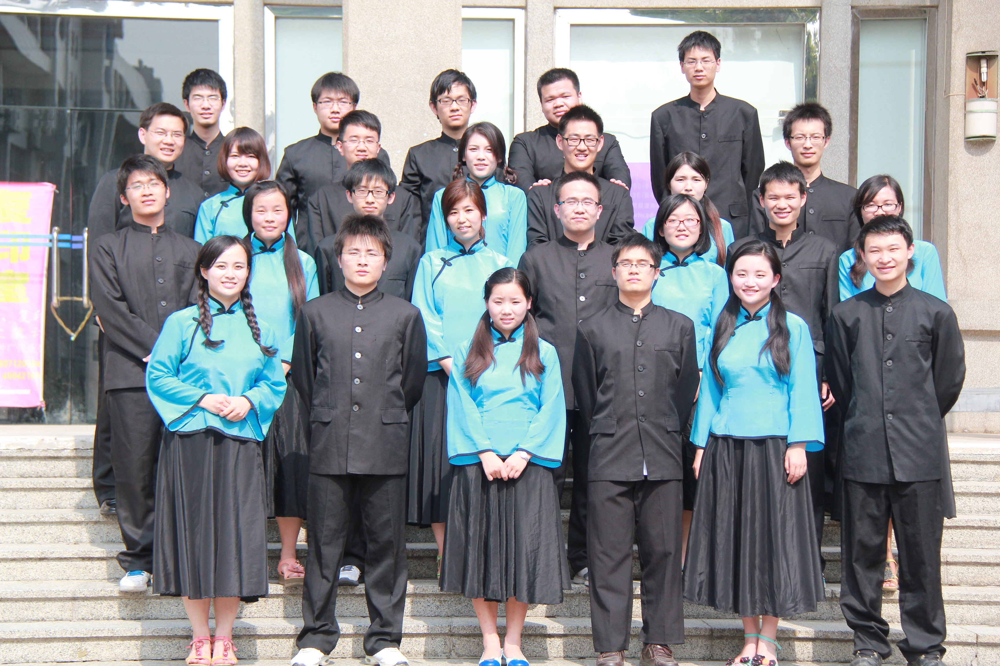
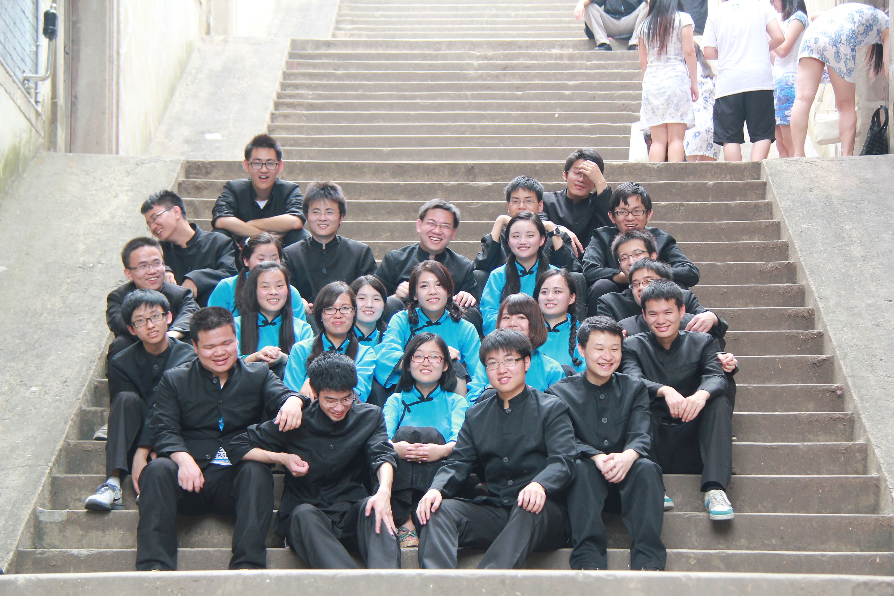
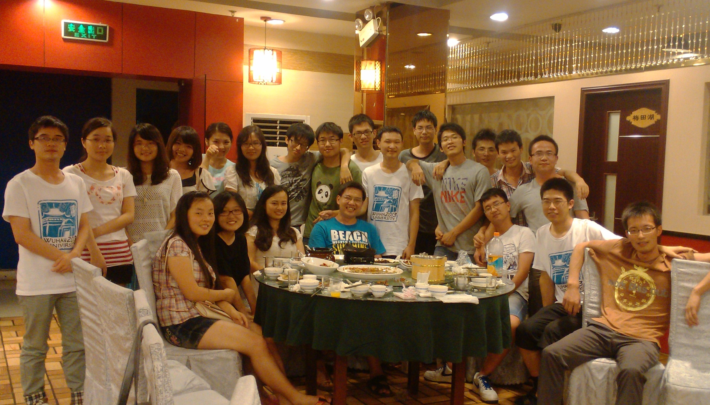
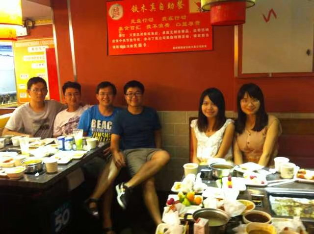
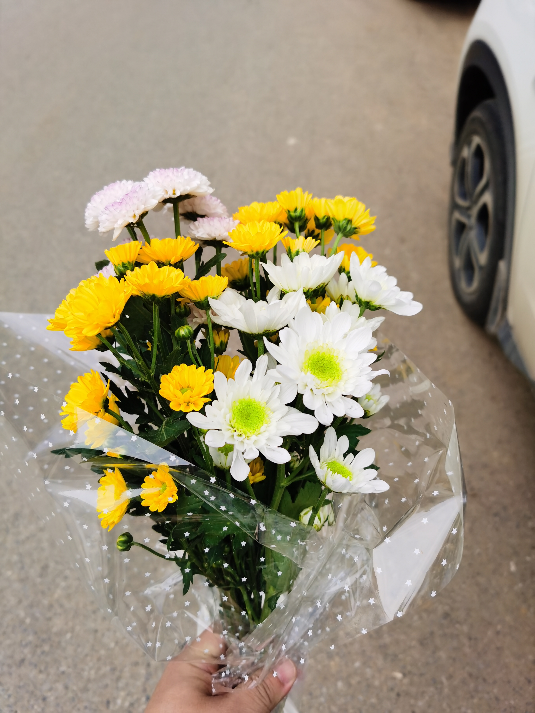
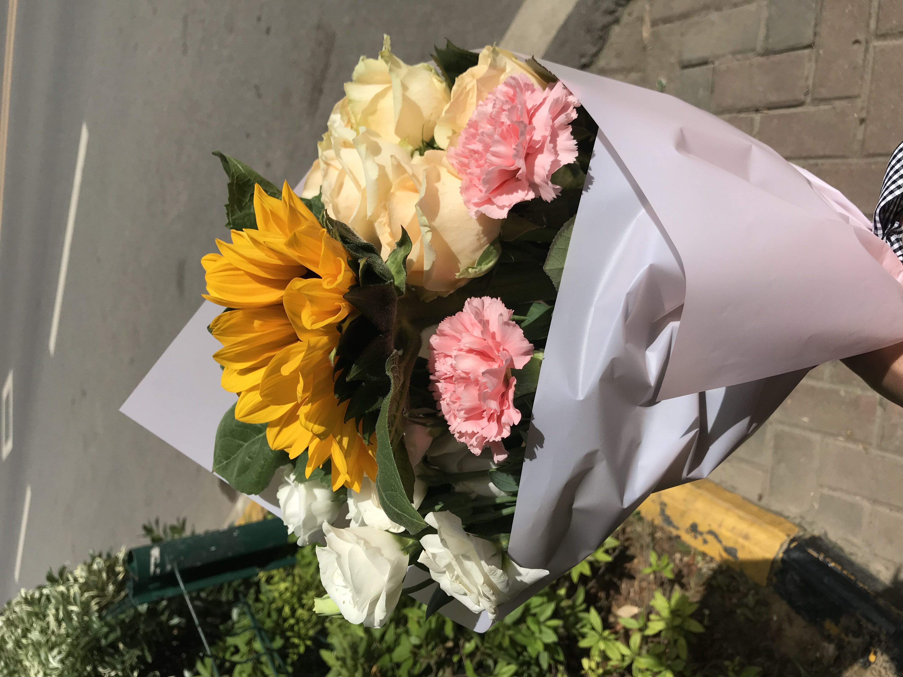

# 🕊️ 2009级计科六班321寝室 - 沈賾 纪念档案

  

> "Program exited with code 0. But the connection remains." 
> 谨以此仓库，纪念我们的好兄弟、好室友、好同学。 (2009 - Now)

---

## 👤 角色档案
* **ID:** 沈賾/Dread Lord
* **班级:** 计科六班 (CS Class 6)
* **寝室:** 8-321
* **位置:** 好室友/SLG重度爱好者/Good Person/最佳辩手/ 

---

## 🎞️ 时光轴 

### 📂 [01. 入学初识（个人视角）](./01_入学)
> 开学报道后找到寝室，推开门见到的第一个大学同学，早忘了第一印象是啥咯。都是父母送着来学校的，外加两个都是i人，所以没啥激烈碰撞，平平淡淡的开始大学四年生活。

### 📂 [02. 宿舍与日常](./02_宿舍与日常)
> 321整体上是个和谐的寝室，些许的矛盾和争吵不会闹到不可开交，学习、玩游戏、看电影、看小说总能有聊到一起的话题，男生也都不记仇，吃吃喝喝就得。何况还有其他寝室的同学以及各种活动，四年的宿舍和大学生活还是丰富多彩的。

### 📂 [03. 课程与学习](./03_课程与学习)
> **上课:** 鉴于本寝室的氛围，上课的积极度和用心度也就那样，性质来了多学学，没有多少知识的追求 
> **上机:** 为什么要提到上机，因为不知道谁拍了你上机的照片咧。 
> **考试:** 考试就像成都吃火锅，得提前踩点和抢位置，花心思想好怎么及格，虽然还是挂了两科哈哈哈 

| 上课 | 上机 | 考试 |
| :---: | :---: | :---: |
|  |  |  |

### 📂 [04. 社团与活动](./04_社团与活动)
> **辩论赛:** &nbsp;&nbsp;&nbsp;&nbsp;&nbsp;&nbsp;&nbsp;你干啥都是温温吞吞的，搞辩论确实散发了另一个性格，要是放现在你就是KOL啊。 
> **拔河:** &nbsp;&nbsp;&nbsp;&nbsp;&nbsp;&nbsp;&nbsp;&nbsp;&nbsp;&nbsp;&nbsp;暂时只有拔河的时候拍了照，当时大家都好精神，拍到你女朋友了哟 
> **张家界旅游:** 论7个男大旅个游被坑不敢反击是什么一回事.jpg 
> **聚餐:** &nbsp;&nbsp;&nbsp;&nbsp;&nbsp;&nbsp;&nbsp;&nbsp;&nbsp;&nbsp;&nbsp;临近大三大四，吃饭聚餐就越来越多了，可能是生活费都涨了，俺们寝室也出去吃了两回 

| 辩论赛 | 拔河比赛 | 张家界 | 聚餐 |
| :---: | :---: | :---: | :---: |
|  |  |  |  |

### 📂 [05. 毕业季](./05_毕业)
> 毕业是2013年，赶上了智能手机的发展，可是拍照这个事儿普遍还是觉得大炮筒更靠谱 
> 毕业了基本上都有了着落，无负担自然开开心心，拍照、换衣服、摆造型，都老老实实听指挥，可能也都知道拍完了也就没机会再拍了。

> **The Fantasy:**为什么叫Fantasy咧，因为你就是有点闷骚啊哈哈哈哈
> 

| 学士服 | 民国风(中山装) | 班服(T-shirt) |
| :---: | :---: | :---: |
|  |  |  |

| 男生合影 | 搞怪摆拍 | 毕业聚餐 |
| :---: | :---: | :---: |
|  |  |  |

### 📂 [06. 工作与生活](./06_工作与生活)
> 13年6月初大家吃完散伙饭，就各奔东西南北。 
> 你去了个好单位啊，铁路上最起码铁饭碗很适合你，刚毕业还没被社会大染缸完全浸透，没有房子，婚姻，赚钱的压力，男生同学这边最起码还能线上插科打诨，玩游戏的，努力工作的，读研读博的，大家都顺顺利利，生活各有苦恼和开心。到北京的还能一起聚餐吃饭，看着就和在大学时候差不多。 
> **北京聚餐:** 
>  

> **后续内容为个人视角** 
> &nbsp;&nbsp;&nbsp;&nbsp;2014年8月12日（应该没记错吧？），记得是栗鹏通知我的，打了电话确认无误后，那是一种不理解的心情，就像玩个游戏角色突然被系统BUG，直接弄掉线了一样，无征兆无预警无原因，当下还讨论说不信医疗诊断，估计也是美剧看多了，你平平和和的性格，不争又不抢的，刚工作能有啥外部因素让你这样，只能遗憾生命不公了。后面我自己去北京出差待了大半年，感觉不是啥好地方，又干又堵，吃喝也不符合武汉的习惯。 
> &nbsp;&nbsp;&nbsp;&nbsp;现在有时候想起你，还是遗憾居多，一方面我单方面认为失去了一个好朋友，不管你认不认可我咯，毕竟散伙饭你离席我还留了几滴眼泪；再个遗憾我没去送你，刚工作穷啊也不敢请假，感谢小夏和文强同志能在现场。20多岁可能不太切实理会失去和遗憾的滋味，个人性格也有些许逃避，所以后面几年同学之间聊天，见面，聚餐也好，其实不会怎么谈起你，因为没人知道该怎么谈。 
> &nbsp;&nbsp;&nbsp;&nbsp;2018年回武汉后打听了你安葬的位置，专门去看了，真是个好地方嘿，依山傍水还是烈士陵园，碑上的照片还是那个浅浅的笑，大学时候觉得是闷骚，现在只觉得亲切。20年疫情武汉1.23封城，正好提前几天去看了你哈哈，然后麻溜的回老家待了3个月，个人琐事之类的，其实也没想着固定什么时间去看看，兴致来了轻车熟路半小时就到了。最开始还幻想着能碰到你爸妈啥的，想起来还是开学第一天见了你爸妈一眼，但真要碰到了我估计也没啥说的，想想而已。 
> &nbsp;&nbsp;&nbsp;&nbsp;最开始我一个人去看你，在花店自己选的鲜花，也没啥讲究，感觉到意思就包着了，还发给小夏看了看。在你碑前也能说个10分钟左右，生活啊，工作啊，相亲啊之类的，nothing special咯。谈恋爱后带着老婆也去看了你一次哦，想起来不知道你还是不是处男咧，也没机会问你。 
> &nbsp;&nbsp;&nbsp;&nbsp;到今年2025年初，俺生了娃咯，每天都忙忙的，也没想起来说实话，明年补上。这次强哥聊了下，我想着也正好是个机会，一方面毕业十年多了，得收集点照片弄个载体，留个回忆总是没错的；再个到了35岁这个阶段，有了家庭后，人都感受和思维总会成长一些，说人话就是思维上老了，开始怀念了。后面带着娃去看你，你那地儿风水好，正气足也不怕邪气啥的。 
> &nbsp;&nbsp;&nbsp;&nbsp;每次去都看着你刚毕业的照片，真年轻嘿，一点都没变，前两天强哥和我说这事儿，我脑子一想啊，真就是一点都没变。 

| 20240406 | 20200118 | 20190501 |
| :---: | :---: | :---: |
|  |  |  |
---

## 💌 留言板 (Guestbook)
如果你有想对他说的悄悄话，或者想分享你们之间的故事，请点击上方的 **[Issues]** 标签页进行留言。 
*We maintain this repository to keep the memory alive.*

---

## 🤝 如何贡献 (Contribution)
如果你手头也有他的照片，欢迎参与完善这个纪念库：
1. **Fork** 本仓库。
2. 将照片放入对应的文件夹（如 `Contributions`）。
3. 提交 **Pull Request**。
4. 或者直接联系管理员上传。

---

Copyright © 20XX Memory of Dread Lord. Forever in our hearts.
